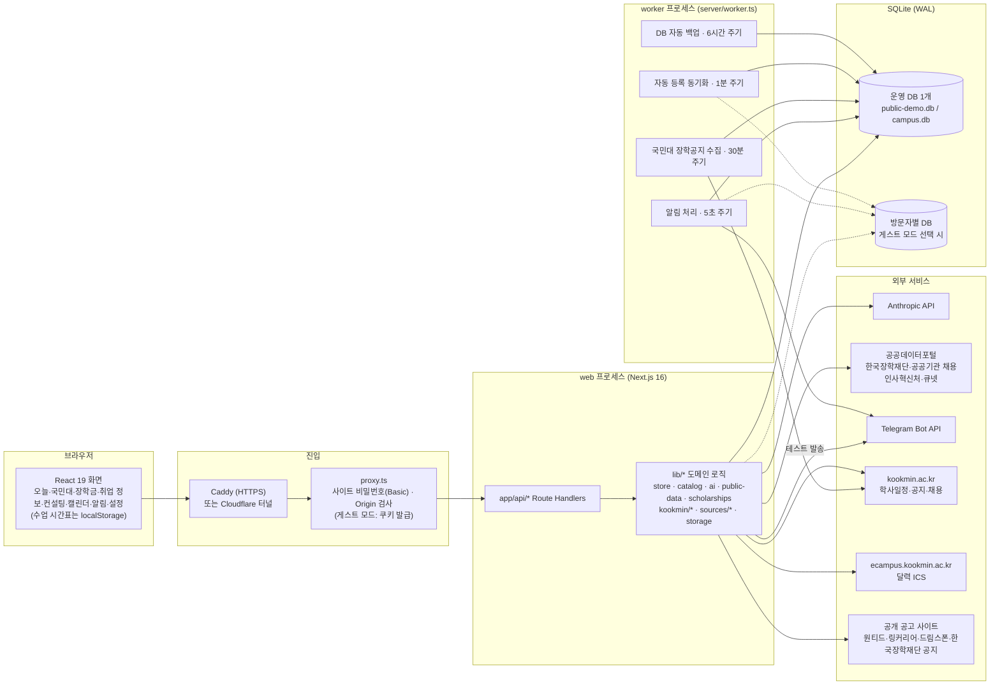
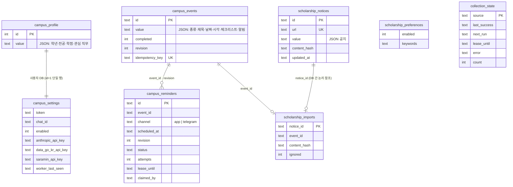
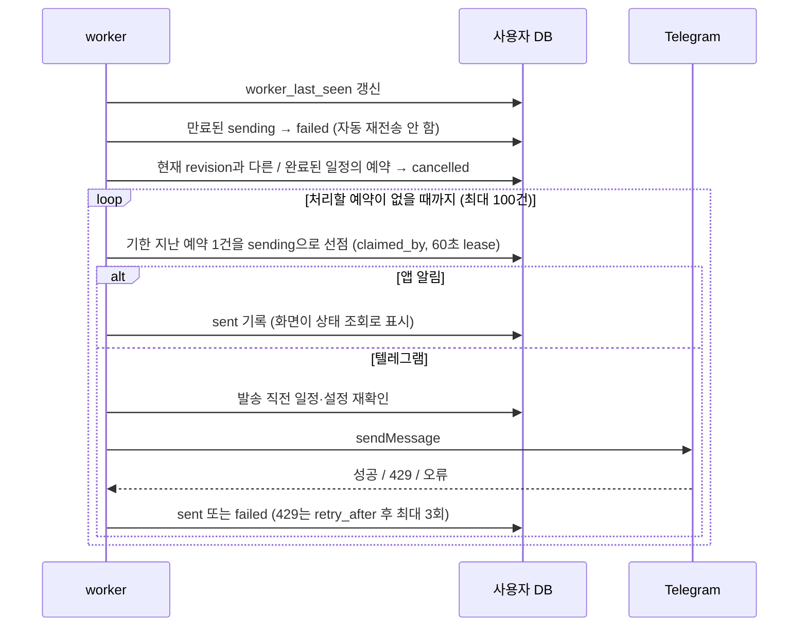
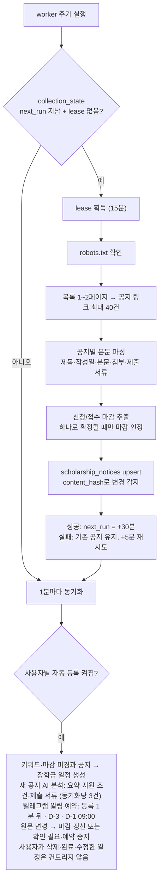
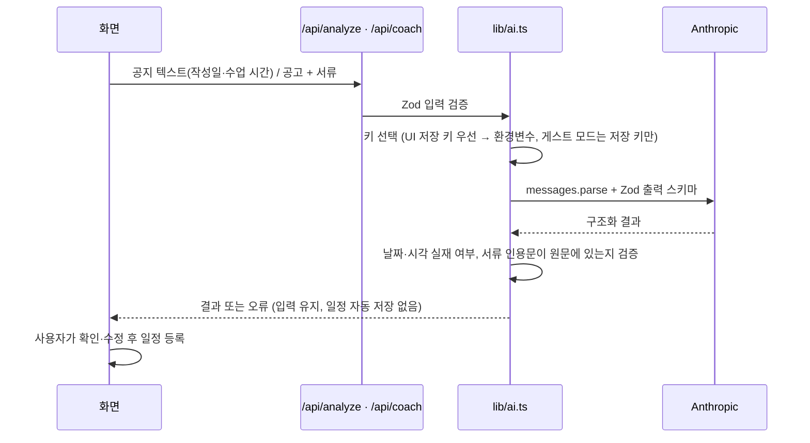
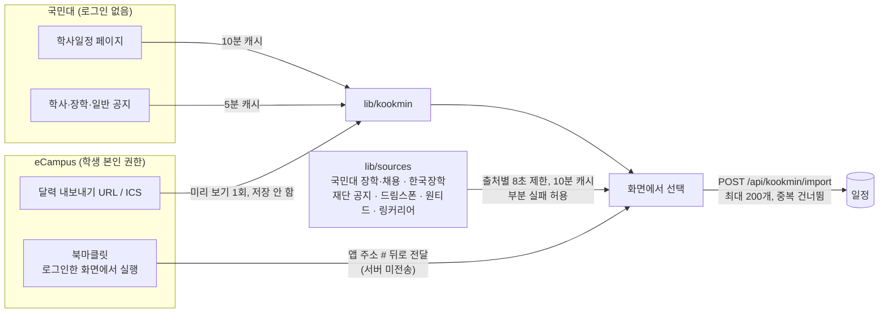
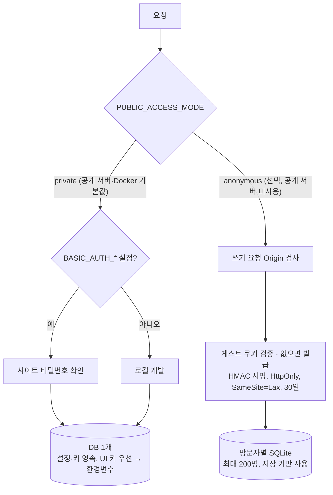
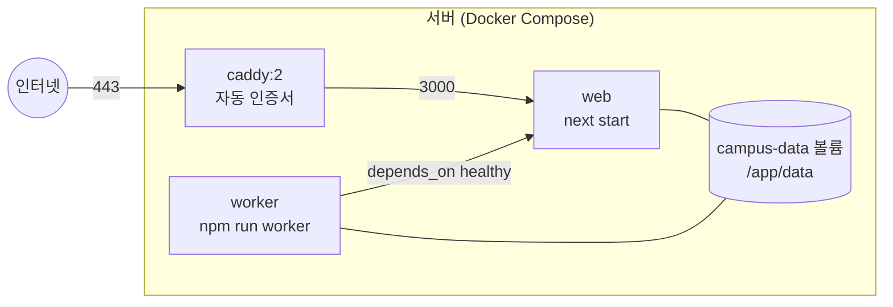

# 아키텍처

AI 대학생활 비서(캠퍼스 비서)의 시스템 구조. 요구사항은 [PRD](../PRD.md), 배포 절차는 [배포 런북](INFRA.md)을 따른다. 2026-10-03 `PRD 0.2`, main `d619add` 기준.

## 1. 한눈에 보기

하나의 코드베이스에서 **웹 프로세스**(Next.js: 화면 + API)와 **worker 프로세스**(알림 발송·학교 공지 수집)가 같은 SQLite 파일을 함께 쓴다. 공개 서버는 DB 하나에 설정·키·일정을 영속 저장하고 사이트 비밀번호로 보호한다(점선은 선택 기능인 게스트 모드). 외부 AI·데이터·메시지 서비스는 서버에서만 호출하고, 브라우저는 자체 API만 부른다.

## 2. 기술 스택

| 영역 | 선택 | 비고 |
|---|---|---|
| 프레임워크 | Next.js 16 (App Router), React 19, TypeScript | `proxy.ts`가 미들웨어 역할 |
| 스타일 | 화면별 CSS(`app/styles/*`), Tailwind 4, 국민대 80주년 톤 디자인 | [디자인 문서](design/KMU80-UI.md) |
| 저장소 | SQLite + `@libsql/client`, WAL·`busy_timeout` | 파일 `0600`, 디렉터리 `0700` |
| 검증 | Zod 4 | API 입력·AI 응답·설정 모두 스키마 검증 |
| AI | `@anthropic-ai/sdk`, `messages.parse` + Zod 구조화 출력 | 모델 `ANTHROPIC_MODEL` |
| 수집 | `cheerio`(HTML 파싱), `robots-parser` | 출처 주소 고정, 출처별 캐시 |
| 실행 | `concurrently`(로컬), Docker Compose(운영), `tsx`로 worker 실행 | |
| 테스트 | Node 내장 test runner(단위 122개), Playwright(E2E) | CI: GitHub Actions |

## 3. 디렉터리 구성

| 경로 | 역할 |
|---|---|
| `app/page.tsx`, `components/` | 단일 페이지 앱. `campus-app.tsx`가 화면 전환과 상태를 관리 |
| `app/api/*/route.ts` | 얇은 HTTP 계층: Origin 검사 → 입력 검증 → `lib` 호출 → JSON 응답 |
| `lib/store.ts` | 프로필·일정·알림 예약·설정의 저장과 상태 조회 |
| `lib/catalog.ts` | 샘플 공고와 프로필 조건 비교(충족/불충족/확인 필요) |
| `lib/ai.ts` | 공지 분석·취업 컨설팅. 구조화 응답 검증, 날짜·인용문 검증 |
| `lib/public-data.ts` | 공공데이터포털 조회(장학금·공공 채용 2개 서비스·시험일정), JSON/XML 해석, 정규화, 30분 캐시 |
| `lib/scholarships.ts` | 국민대 장학공지 주기 수집·파싱·마감 추출·자동 등록 |
| `lib/kookmin/*` | 국민대 학사일정·공지 읽기(10분·5분 캐시), eCampus ICS 해석, 북마클릿 생성, 일정 변환 |
| `lib/sources/*` | 키 없는 실시간 공고 출처별 파서, 동시 조회·부분 실패·매칭 점수 |
| `lib/storage.ts` | DB 백업(`VACUUM INTO`)·보관 개수 관리, 저장된 데이터 요약(키는 앞뒤 4자) |
| `lib/timetable.ts` | 수업 시간표(브라우저 저장)로 "수업 전" 마감 후보 계산 |
| `lib/reminder-worker.ts`, `lib/telegram.ts` | 알림 예약 처리, 텔레그램 발송 |
| `lib/db.ts`, `lib/anonymous-session.ts` | DB 생성·마이그레이션, 게스트 세션과 방문자별 DB |
| `lib/http.ts`, `lib/basic-auth.ts`, `proxy.ts` | 같은 출처 검사, 오류 응답, 사이트 인증 |
| `server/worker.ts` | 알림·장학공지 수집·자동 등록 동기화·자동 백업 루프 |
| `tests/`, `e2e/` | 단위·브라우저 테스트 |

## 4. API

| 경로 | 메서드 | 기능 |
|---|---|---|
| `/api/state` | GET | 프로필·일정·알림·설정 상태 한 번에 조회 |
| `/api/profile` | GET · PUT | 학생 프로필 조회·저장 |
| `/api/events`, `/api/events/[id]` | POST · PATCH · DELETE | 일정 생성(멱등 키)·수정·완료·삭제, 알림 예약 재생성 |
| `/api/notifications/read` | POST | 알림 읽음 처리 |
| `/api/catalog` | GET | 프로필 기준 샘플 공고 비교 결과 |
| `/api/public-data` | GET | 공공데이터포털 장학금·공공 채용(공공기관 + 인사혁신처)·시험일정 |
| `/api/scholarships` | GET | 국민대 수집 공지·수집 상태·자동 등록 설정 |
| `/api/scholarships/preferences` | PUT | 자동 등록 설정 저장 후 즉시 동기화 |
| `/api/kookmin/schedule` | GET | 국민대 학사일정(`?year=`) |
| `/api/kookmin/notices`, `/api/kookmin/notices/[board]/[articleNo]` | GET | 학사·장학·일반 공지 목록과 본문 |
| `/api/kookmin/ecampus/preview` | POST | eCampus 달력 URL 또는 ICS 내용 → 과제 목록(URL은 저장하지 않음) |
| `/api/kookmin/import` | POST | 학사일정·공지·과제 일괄 저장(1~200개, 중복 건너뜀) |
| `/api/kookmin/bookmarklet` | GET | `APP_URL`이 들어간 북마클릿 코드 |
| `/api/opportunities/live`, `/api/opportunities/live/text` | GET | 키 없는 실시간 공고, 국민대 공지 본문 |
| `/api/storage` | GET · POST | 저장된 데이터 요약, 즉시 백업 |
| `/api/analyze` | POST | 과제·공고 공지 텍스트 AI 분석 |
| `/api/coach` | POST | 목표 공고 + 서류 AI 컨설팅 |
| `/api/settings` | GET · PUT | 텔레그램 설정 조회·저장(토큰은 응답하지 않음) |
| `/api/settings/ai`, `/api/settings/data-keys` | PUT · DELETE | AI·외부 데이터 키 저장·삭제(설정 여부·출처만 응답) |
| `/api/telegram/test` | POST | 가장 가까운 일정을 실제 알림 형식으로 테스트 발송 |
| `/api/health` | GET | 상태 확인(Docker는 사이트 비밀번호를 붙여 호출, 게스트 모드에서는 DB를 만들지 않음) |

쓰기 요청은 모두 `assertSameOrigin`을 통과해야 한다(localhost 또는 `APP_URL`과 같은 Host·Origin).

## 5. 데이터 모델

테이블은 두 갈래다. **공용 테이블**은 방문자와 무관한 학교 공지와 수집 상태를, **사용자 테이블**은 프로필·일정·설정을 담는다. 공개 서버·로컬(`private`)에서는 둘 다 한 파일(`DATABASE_URL`, 공개 스크립트는 `data/public-demo.db`)에 있고, 게스트 모드(`anonymous`)를 켜면 사용자 테이블이 방문자마다 따로 생긴다.

- `scholarship_notices`, `collection_state`는 공용 DB(`getSharedDatabase`)에만 만든다.
- 설정·키는 DB에 있으므로 DB 파일이 곧 운영 상태다. 공개 스크립트는 시작 전마다 `data/backups/pre-start-*.db`로, worker는 6시간마다 `auto-*.db`로 백업한다(자동 백업만 최근 28개 보관). DB 파일이 없으면 빈 DB를 만들지 않고 멈춘다.
- 수업 시간표는 서버에 저장하지 않고 브라우저 `localStorage`에만 둔다.
- 일정을 수정하면 `revision`이 올라가고, 이전 revision의 미발송 알림은 worker가 취소한다.
- 일정 생성은 `idempotency_key`로 연속 클릭·자동 등록 중복을 막는다. 자동 등록 일정의 키는 공지 ID(`kookmin:<번호>`)다.

## 6. 핵심 흐름

### 6.1 알림 발송 (worker, 5초 주기)

- 선점(`UPDATE … RETURNING`)과 lease로 프로세스가 여러 개여도 같은 예약을 한 번만 처리한다.
- 응답이 불명확한 텔레그램 발송은 중복 위험 때문에 자동 재전송하지 않고 실패로 남긴다.
- 샘플 일정은 텔레그램으로 보내지 않는다. 게스트 모드에서는 활성 게스트 DB마다 같은 처리를 반복하고, 만료된 게스트는 건너뛰고 정리한다.

### 6.2 국민대 장학공지 수집과 자동 등록

- 요청은 `https://www.kookmin.ac.kr`만 허용하고 리다이렉트를 따르지 않는다. 응답 15초·2MB 제한, 요청 간 최소 0.5초(robots crawl-delay 우선).
- 마감 추출은 규칙 기반이다. `상시`·`추후 공지`·범위 시작만 있는 경우·후보가 여럿인 경우는 확인 필요로 두고 자동 등록하지 않는다.
- 자동 등록 설정을 저장하면 API가 즉시 한 번 동기화해 worker 주기를 기다리지 않는다.
- 새로 자동 등록한 일정에는 텔레그램 알림을 등록 1분 뒤 1회와 마감 3일 전·1일 전 09:00(한국 시간)에 예약한다(`automaticReminders`, 텔레그램 채널만). 지난 시각과 마감 이후 시각은 빼고, 기존 자동 등록 일정에는 소급하지 않는다. 텔레그램 메시지에는 원문 링크가 붙는다.
- 새로 자동 등록하는 공지는 `analyzeText`(6.3)로 학생 프로필과 비교해 요약·지원 조건·제출 서류를 일정 메모에 넣고, 메모가 텔레그램 메시지에도 실린다. 마감은 규칙 추출 값을 유지하고, AI 실패·키 없음이어도 일정과 알림은 등록한다. 동기화 한 번에 최대 3건만 분석해 알림 처리가 길게 멈추지 않게 한다.

### 6.3 AI 분석·컨설팅

AI 결과는 항상 사용자 확인을 거쳐 일정이 된다. 샘플 결과는 샘플 입력에만 쓰고, 실제 입력의 분석 실패를 샘플로 대체하지 않는다.

### 6.4 공공데이터포털

`lib/public-data.ts`가 아래 서비스를 호출해 공통 `Opportunity`·`ExamSchedule` 형식으로 정규화한다. 응답은 서버 메모리에 30분 캐시하며(새로고침은 캐시 무시) 게이트웨이 오류는 키 미등록·활용신청 누락·한도 초과 안내로 바꾼다.

| 화면 출처 | 서비스 | 처리 |
|---|---|---|
| 장학금 · 한국장학재단 | 학자금지원정보(`api.odcloud.kr`) | 최신 월간 데이터셋 자동 선택, 모집 중만, 학년·학과 비교 |
| 취업 정보 · 공공 채용 | 공공기관 채용정보(`apis.data.go.kr/1051000`) + 인사혁신처 공공취업정보(`apis.data.go.kr/1760000`, 나라일터) | 두 결과를 합쳐 모집 중만 표시. 인사혁신처는 공고유형 e01~e04·최근 60일 등록분, XML 응답, 응시 자격은 항상 확인 필요. 한쪽이 실패하면 다른 쪽 공고와 실패 사유를 함께 반환 |
| 취업 정보 · 자격증 시험 | 국가자격 시험일정(`apis.data.go.kr/B490007`) | 원서접수·시험·발표를 단계별 일정으로 |

### 6.5 국민대 연동과 실시간 공고

- 학교 비밀번호는 다루지 않는다. eCampus 달력 URL은 개인 토큰이라 저장·로그 기록하지 않고 `ecampus.kookmin.ac.kr/calendar/export_execute.php`만 허용한다. 성공 여부는 HTTP 상태가 아니라 응답이 `BEGIN:VCALENDAR`로 시작하는지로 판단한다.
- 가져온 일정은 가져온 시점의 사본이다. 원문 변경을 따라가는 것은 6.2의 장학공지 자동 등록뿐이다.
- 실시간 공고의 마감은 원본이 밝힌 값만 쓰고, 매칭 점수는 지원 자격 판정이 아니다. 세부 내용은 [KOOKMIN.md](KOOKMIN.md), [SOURCES.md](SOURCES.md).

## 7. 접근 모드와 보안

공개 서버는 설정이 재배포 후에도 남아야 하므로 `private` + DB 하나로 운영한다. 게스트 모드는 쿠키 삭제·만료 시 설정이 사라져 공개 서버에 맞지 않지만, 사용자별 분리가 필요한 데모를 위해 코드와 테스트를 유지한다.

| 항목 | 처리 |
|---|---|
| 비밀값 | API 키·봇 토큰은 서버 DB에만 저장, 상태 응답·로그·클라이언트 번들에 포함하지 않음 |
| 공유 범위 | 공개 서버는 비밀번호를 아는 사람끼리 데이터·키를 공유 → 팀 공용 키만 저장. 게스트 모드는 방문자별 DB와 저장 키만 사용 |
| 파일 권한 | DB·WAL·SHM `0600`, 데이터·세션 디렉터리 `0700`, 세션 서명 키 `0600` |
| 응답 헤더 | HSTS·nosniff·Referrer-Policy(Caddy), 게스트 모드는 `Cache-Control: private, no-store`·CORP same-origin 추가 |
| 외부 요청 | 서버가 읽는 주소는 고정 출처뿐. 사용자가 넣는 URL은 eCampus 달력 내보내기 주소 형식만 허용 |
| 로그 | 원문·서류·프로필을 로그에 남기지 않음 |

## 8. 배포

| 방식 | 구성 | 용도 |
|---|---|---|
| Docker Compose | web + worker(같은 이미지, 명령만 다름) + Caddy, `campus.knowverse.net`, `PUBLIC_ACCESS_MODE=private` 고정 | 상시 운영 |
| nginx 서버 | Caddy 없이 web을 `127.0.0.1:3100`에 열고 기존 nginx로 프록시 | 80·443을 이미 쓰는 서버 |
| Cloudflare 터널 | `scripts/share-public.sh`, 맥에서 실행. `private` 강제, 시작 전 DB 백업, DB 없으면 중단 | 무료 데모 |
| 로컬 | `npm run dev`(web + worker 동시 실행) | 개발 |

- worker가 없으면 앱 내 알림도 처리되지 않는다(`pending → sent`를 worker가 담당).
- `@libsql/client`는 네이티브 바이너리라 배포 대상과 같은 아키텍처에서 빌드한다.
- 설정·키는 DB에 있으므로 배포 시 `campus-data` 볼륨을 유지해야 한다(`docker compose down -v` 금지).
- CI(`.github/workflows/ci.yml`): PR·`main` push마다 타입 검사 → 단위 테스트 → 빌드 → Docker 이미지 빌드. 배포는 수동.

## 9. 설계 원칙과 한계

| 원칙 | 구현 |
|---|---|
| 추정하지 않기 | 작성일·수업 시간·마감이 불명확하면 확인 필요로 두고 임의 시각(`23:59` 등)을 확정하지 않음 |
| 사용자 결정 우선 | AI 결과·자동 등록은 사용자가 지우거나 고친 일정을 덮어쓰지 않음 |
| 중복보다 누락 안내 | 결과가 불명확한 외부 발송은 재전송하지 않고 실패로 기록 |
| 저장과 검증 구분 | 키 저장은 외부 호출 없이 처리, 실제 유효성은 사용 시 확인 |

| 한계 | 영향 | 후속 |
|---|---|---|
| SQLite 단일 호스트·단일 DB | 수평 확장 불가, 사용자별 데이터 분리 없음 | 사용자 증가 시 서버 DB·학교 계정 로그인 |
| 공유 비밀번호 | 접속자 구분·감사 기록 없음 | 계정·권한 도입 |
| HTML 구조 의존 수집 | 학교·공개 사이트 개편 시 해당 출처만 실패 | 학교 공식 데이터 제공 협의 |
| 비공식 공개 엔드포인트 | 원티드·링커리어 응답이 예고 없이 바뀔 수 있음, 약관 확인 필요 | 공식 제휴·API |
| 상주 worker 필요 | 서버리스 배포 시 별도 cron 필요 | 큐·스케줄러 분리 |
